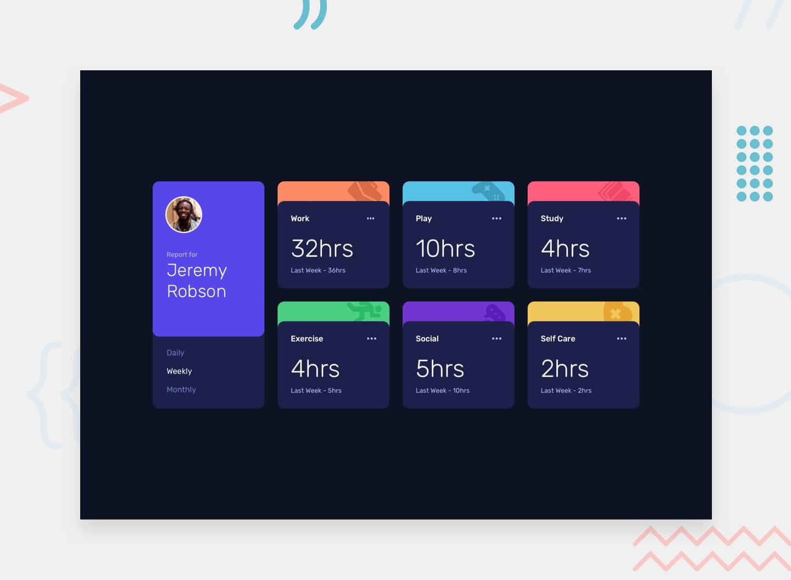

# Frontend Mentor - Time tracking dashboard

## Welcome! 👋

Hi I just finished, this challenge from frontend mentor.

The last challenge I use HTML, CSS grid and JavaScript vanilla, but and this new version I use:
  - HTML
  - TailwindCss
  - JavaScript
  
For the Javascript section, I decide use classes and methods, from OOP.

## This is the [link](https://github.com/Arirockdev/time-tracking-dashboard-with-tailwind.git) for the deploy project.

**Have fun building!** 🚀
